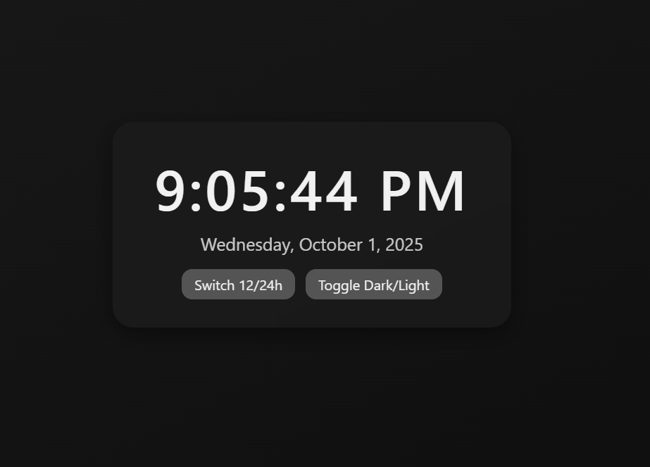

# ⏰ Digital Clock

A simple beginner-friendly digital clock project using **HTML, CSS, and JavaScript**.  
Shows your system’s current time and date with a clean design.

---

## ✨ Features
- Displays real-time hours, minutes, and seconds
- Shows today’s date
- Lightweight (no libraries or frameworks)
- Beginner-friendly code

---

## 📸 Screenshot

---

## 🚀 How to Use
1. Download or clone this repository  
2. Open `index.html` in your browser  
3. Done ✅

---

## 🔑 License
This project is licensed under the [MIT License](./LICENSE).
